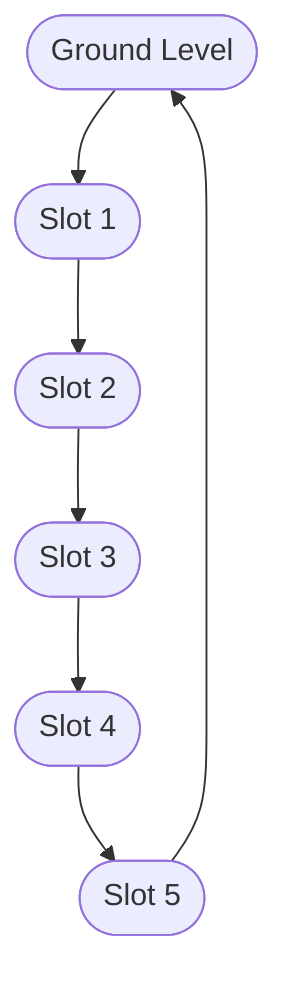

# Architecture

- Vertical rotary parking system with 5 slots arranged in a loop
- Cars are loaded/unloaded at the ground level
- Mechanism rotates to bring the desired slot to ground
- Sensors detect slot occupancy and position
- PLC controls rotation and slot selection

# Control Plan
- On car detection at ground, rotate to empty slot, load car
- On retrieval request, rotate to requested slot, unload car
- Emergency stop disables all outputs

# Hardware Spec
- 5 slot sensors
- 1 position sensor per slot
- 1 car detection sensor
- 1 emergency stop
- 1 rotary motor
