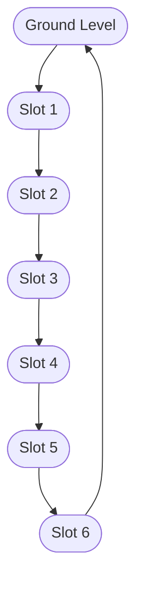
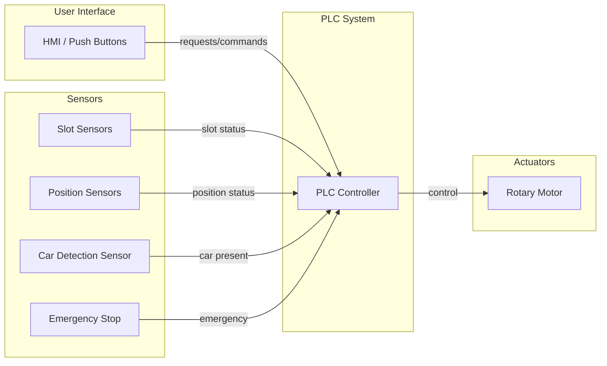
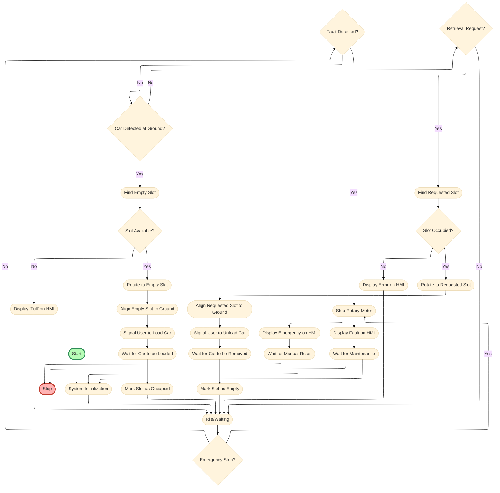

# Architecture

- Vertical rotary parking system with 6 slots arranged in a loop
- Cars are loaded/unloaded at the ground level
- Mechanism rotates to bring the desired slot to ground
- Sensors detect slot occupancy and position
- PLC controls rotation and slot selection

# Control Plan
- On car detection at ground, rotate to empty slot, load car
- On retrieval request, rotate to requested slot, unload car
- Emergency stop disables all outputs

# Hardware Spec
- 6 slot sensors
- 1 position sensor per slot
- 1 car detection sensor
- 1 emergency stop
- 1 rotary motor

# System Architecture

# Control Logic Flowchart

# Detailed Control Logic (Step-by-Step)

1. **System Initialization**
   - Initialize all sensors and actuators.
   - Ensure rotary motor is stopped and system is in safe state.
   - Check all slots and position sensors for status.

2. **Idle/Waiting State**
   - Continuously monitor for car detection at ground level or retrieval request from user interface.
   - Monitor emergency stop at all times.

3. **Parking Sequence**
   - On car detection at ground level:
     1. Scan all slot sensors to find the first available (empty) slot.
     2. If no slot is available, display "Full" on HMI and return to idle.
     3. If a slot is available, determine the shortest rotation direction (clockwise/counterclockwise) to bring the empty slot to ground.
     4. Activate rotary motor in the chosen direction.
     5. Use position sensors to stop rotation when the empty slot aligns with ground level.
     6. Confirm slot is at ground and empty, then signal user to load car.
     7. Wait for car to be loaded (can use a load sensor or user confirmation button).
     8. Mark slot as occupied, update HMI, and return to idle.

4. **Retrieval Sequence**
   - On retrieval request (user selects slot):
     1. Check if requested slot is occupied.
     2. If not occupied, display error on HMI and return to idle.
     3. If occupied, determine shortest rotation direction to bring requested slot to ground.
     4. Activate rotary motor in the chosen direction.
     5. Use position sensors to stop rotation when requested slot aligns with ground level.
     6. Signal user to unload car.
     7. Wait for car to be removed (can use a load sensor or user confirmation button).
     8. Mark slot as empty, update HMI, and return to idle.

5. **Emergency Stop Handling**
   - At any time, if emergency stop is pressed:
     1. Immediately cut power to rotary motor and halt all movement.
     2. Display emergency message on HMI.
     3. Wait for manual reset before resuming operation.

6. **Fault Handling**
   - Monitor for sensor or actuator faults (e.g., sensor stuck, motor overload).
   - If a fault is detected, stop all operations, display fault on HMI, and require maintenance intervention.

7. **Manual Override (Optional)**
   - Allow maintenance personnel to manually rotate or access slots for service, with safety interlocks.

# Detailed Control Logic Flowchart

