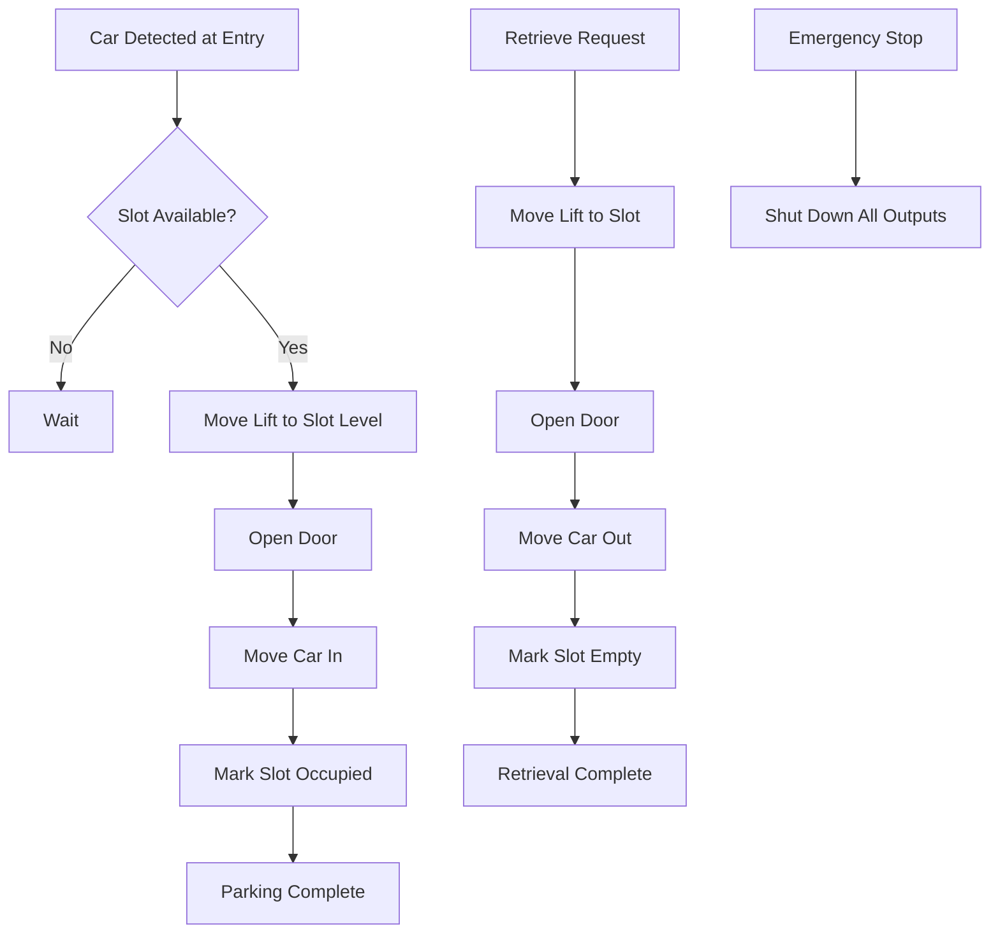

# Vertical Parking System - Flowchart

```mermaid
flowchart TD
    A[Car Detected at Entry] --> B{Slot Available?}
    B -- No --> C[Wait]
    B -- Yes --> D[Move Lift to Slot Level]
    D --> E[Open Door]
    E --> F[Move Car In]
    F --> G[Mark Slot Occupied]
    G --> H[Parking Complete]

    I[Retrieve Request] --> J[Move Lift to Slot]
    J --> K[Open Door]
    K --> L[Move Car Out]
    L --> M[Mark Slot Empty]
    M --> N[Retrieval Complete]

    O[Emergency Stop] --> P[Shut Down All Outputs]
```
