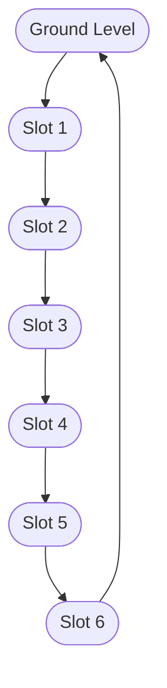
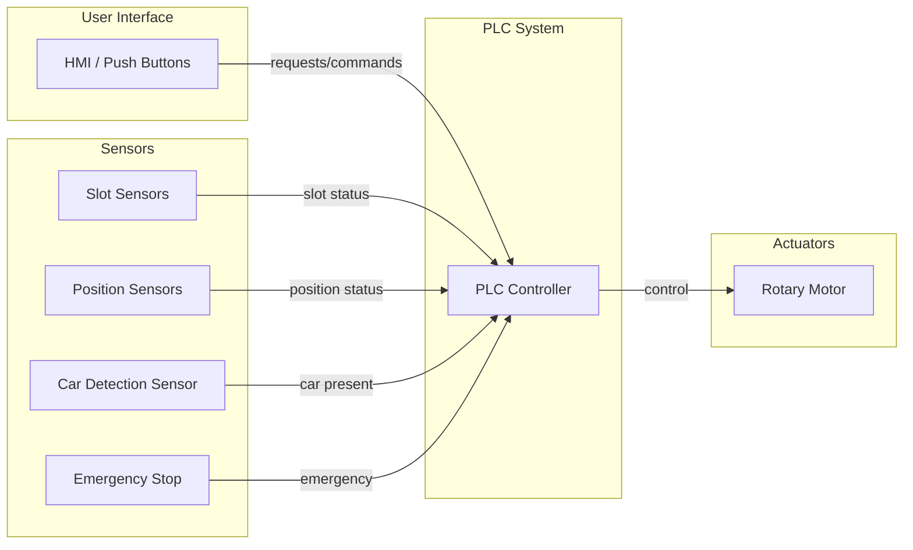
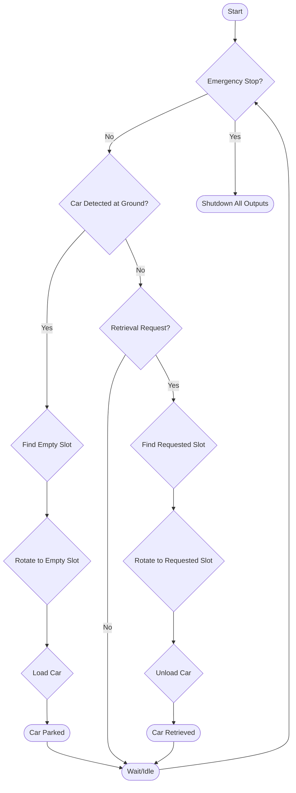
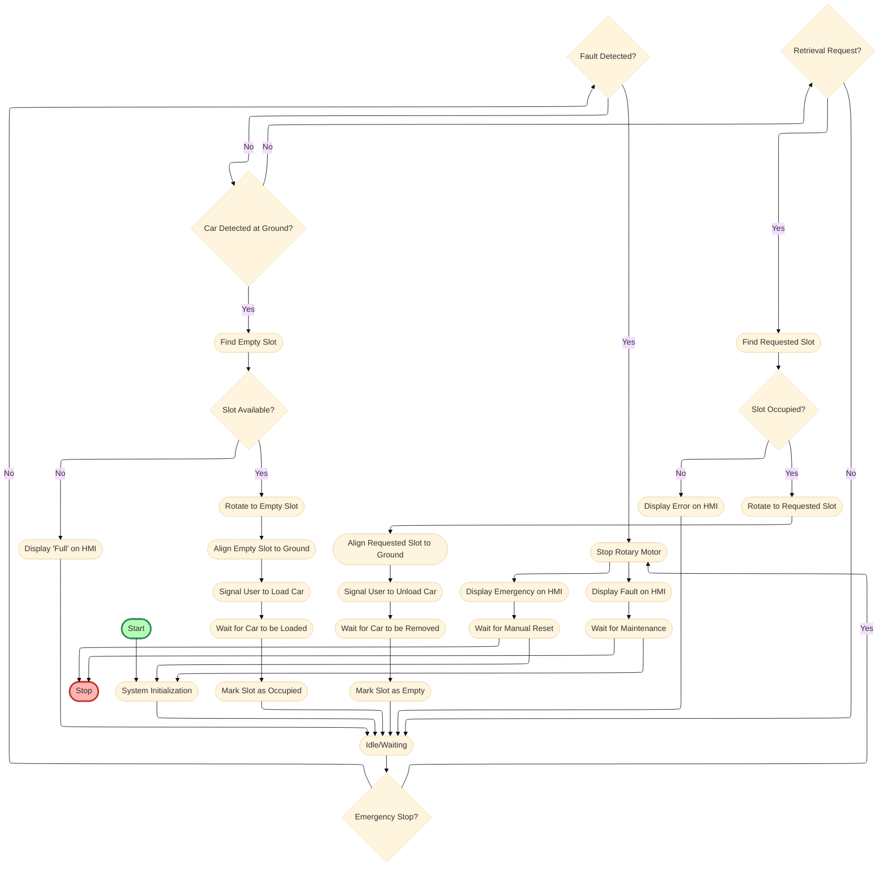

# 4. Model Sistem PARKING

## 4.1 Pendahuluan

Model sistem Parkir Otomatis (PARKING) merupakan representasi sistem simulasi yang menggambarkan proses dasar manajemen parkir otomatis menggunakan teknologi sensor, barrier gate, dan kontrol otomatis. Model ini dirancang sebagai platform pembelajaran dan demonstrasi untuk memahami prinsip-prinsip fundamental operasi sistem parkir otomatis dalam lingkungan terkontrol.

## 4.2 Komponen Utama Sistem PARKING

Sistem PARKING terdiri dari beberapa subsistem utama yang saling terintegrasi untuk membentuk proses manajemen parkir yang komprehensif dan otomatis.

### 4.2.1 Subsistem Deteksi Kendaraan

Subsistem deteksi kendaraan berfungsi sebagai titik masuk data kendaraan ke dalam sistem simulasi. Sensor kendaraan disimulasikan untuk mendeteksi keberadaan kendaraan pada slot parkir dan pintu masuk/keluar. Data sensor dikirim ke sistem kontrol untuk monitoring dan pengambilan keputusan.

### 4.2.2 Subsistem Kontrol Akses (Barrier Gate)

Tahap ini mengatur akses kendaraan masuk dan keluar area parkir. Barrier gate dikendalikan secara otomatis berdasarkan status slot parkir dan validasi tiket/kartu akses. Sensor posisi memastikan barrier beroperasi dengan aman.

### 4.2.3 Subsistem Monitoring Slot Parkir

Sistem monitoring slot parkir memantau status setiap slot secara real-time dan menampilkan informasi ketersediaan pada display digital. Data ini juga digunakan untuk analisis penggunaan lahan parkir.

### 4.2.4 Subsistem Manajemen Data Parkir

Data kendaraan, waktu masuk, dan keluar dicatat secara otomatis untuk keperluan pelaporan dan analisis. Sistem ini juga dapat terintegrasi dengan sistem pembayaran otomatis.

### 4.2.5 Subsistem Kontrol Otomatis

Subsistem kontrol menggunakan logika sederhana untuk mengkoordinasikan operasi dasar sistem parkir. Sistem kontrol berbasis PLC atau Python memproses sinyal dari sensor dan mengontrol aktuator berdasarkan algoritma yang telah diprogram. HMI menyediakan interface operator untuk monitoring dan kontrol manual.

## 4.3 Prinsip Operasi dan Integrasi Sistem

Sistem PARKING beroperasi secara terintegrasi dengan mengutamakan efisiensi, keamanan, dan kemudahan akses bagi pengguna dan operator.

## 4.4 Lampiran: Diagram Arsitektur dan Flowchart Sistem PARKING

### 4.4.1 Diagram Arsitektur Sistem PARKING

Diagram berikut menggambarkan arsitektur sistem rotary parking 6 slot:

### 4.4.2 Diagram System Architecture

### 4.4.3 Flowchart Proses dan Kontrol PARKING

### 4.4.4 Detailed Control Logic Flowchart

Penjelasan detail dan diagram lain dapat dilihat pada file architecture.md dan parking-flowchart.md.
