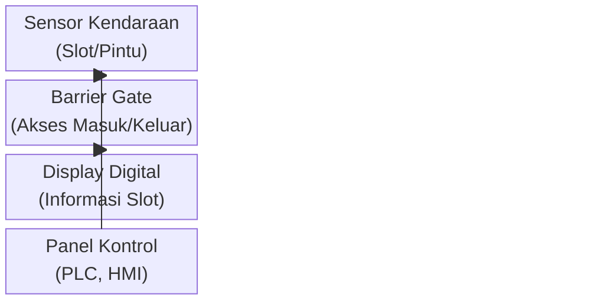

# 7. Posisi Utilitas PARKING

Penataan posisi utilitas dalam sistem PARKING sangat penting untuk memastikan efisiensi operasional, kemudahan pemeliharaan, dan keamanan sistem secara keseluruhan. Berikut penjelasan posisi dan peran strategis masing-masing utilitas:

## 7.1 Diagram Posisi Utilitas

## 7.2 Panel Kontrol
Panel kontrol ditempatkan di ruang kontrol atau dekat area parkir utama. Lokasi ini dipilih agar operator mudah memantau dan mengendalikan seluruh sistem, serta memudahkan akses saat troubleshooting atau pemeliharaan.

## 7.3 Sensor Kendaraan
Sensor kendaraan dipasang di setiap slot parkir dan pintu masuk/keluar untuk mendeteksi keberadaan kendaraan secara real-time.

## 7.4 Barrier Gate
Barrier gate ditempatkan di pintu masuk dan keluar area parkir untuk mengatur akses kendaraan secara otomatis.

## 7.5 Display Digital
Display digital dipasang di area strategis untuk menampilkan status ketersediaan slot parkir kepada pengguna.
